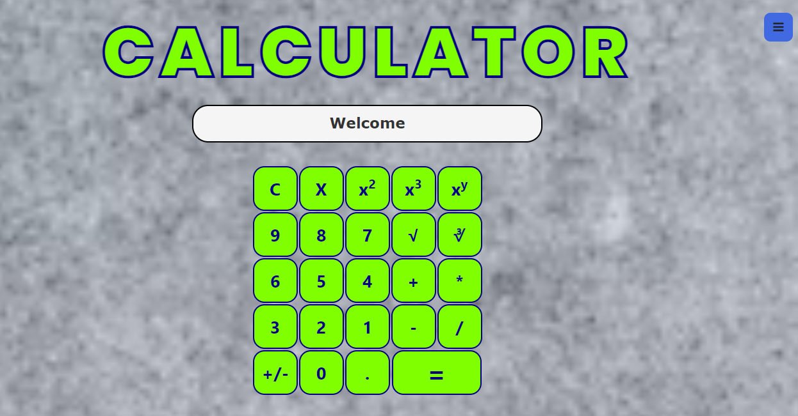
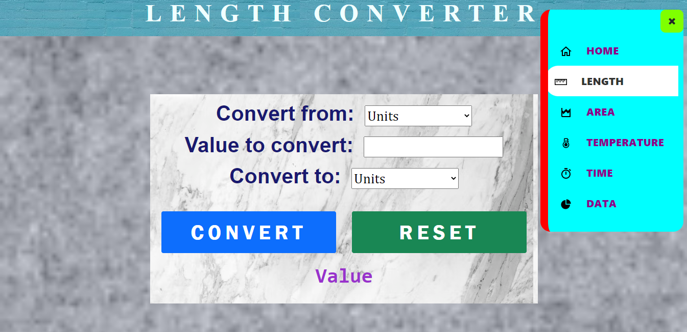
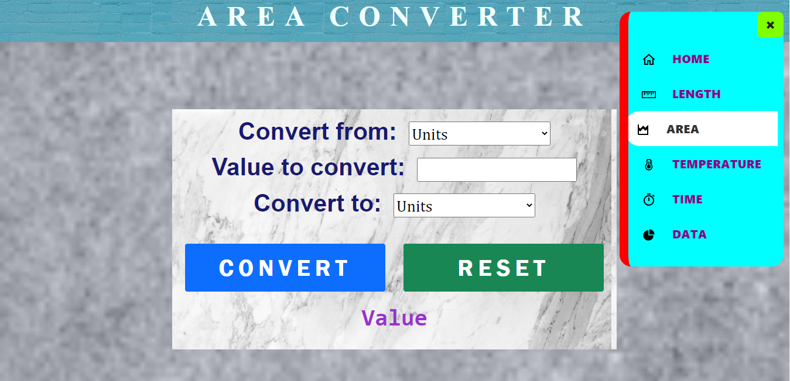
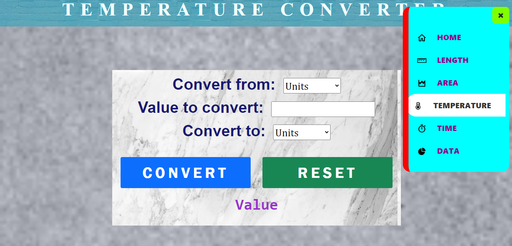
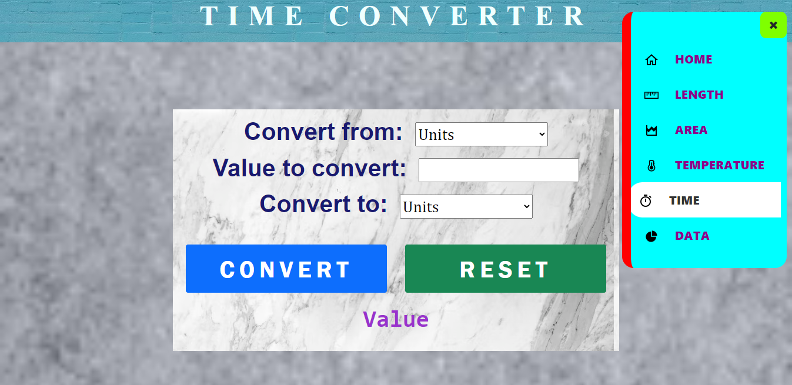
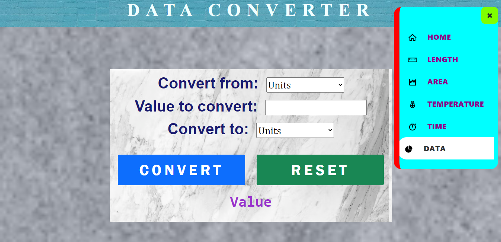

# Calculator

Calculator & Unit Converter App! This web application is built using HTML, CSS, and JavaScript and offers a comprehensive set of features for performing calculations and converting units across various categories like length, area, time, temperature, and more. It's your one-stop solution for all your mathematical and unit conversion needs!

# Features

## Calculator

Perform basic arithmetic calculations including addition, subtraction, multiplication, and division. It also supports decimal numbers, parentheses for complex expressions, and has a clear button to erase any mistakes.

## Unit Converter

Convert measurements between different units effortlessly. Whether you need to convert lengths, areas, time, temperature, or other common units, this app has got you covered. Simply select the unit type, enter the value, and instantly get the converted result.

# How to Use

1. Clone or download the repository to your local machine.
2. Open the 'index.html' file in your web browser.
3. You'll see the main page of the app with a calculator and various unit conversion options.
4. To perform calculations, use the buttons provided on the calculator interface. Enter numbers, operators, and parentheses as needed and click the equal (=) button to see the result.
5. To use the unit converter, select the desired unit category from the dropdown menu. Enter the value you want to convert, choose the input unit, and select the output unit. Click the "Convert" button to see the converted result.

# Screenshots

# Technologies Used

- HTML
- CSS
- JavaScript
